# Kotlin Template

[](#testes-e-cobertura)
[](https://github.com/skatesham/template-spring-kotlin-java25-postgres-kafka-redis/actions/workflows/ci.yml)
[](https://github.com/skatesham/template-spring-kotlin-java25-postgres-kafka-redis/tags)
[](LICENSE)

[](build.gradle)
[](build.gradle)
[](build.gradle)
[](gradle/wrapper/gradle-wrapper.properties)
[](compose.yaml)
[](compose.yaml)
[](compose.yaml)

API modular em **Kotlin + Spring Boot**, com Spring MVC, JPA bloqueante e domínio independente de infraestrutura. O projeto implementa autenticação e um fluxo completo de Customer: **REST → PostgreSQL + Outbox → Kafka → auditoria e notificações**, com cache Redis, idempotência e recuperação de falhas.

[Primeira execução](#primeira-execução) · [Features](#features-implementadas) · [Diagrama](#como-o-fluxo-funciona) · [API](#api-e-autenticação) · [Falhas](#retry-dlt-e-recuperação) · [Makefile](#comandos-do-makefile) · [Testes](#testes-e-cobertura)

## Primeira execução

Você precisa de **JDK 25**, Docker com Docker Compose, GNU Make e OpenSSL. O daemon Docker deve estar ativo e acessível pelo seu usuário. O Wrapper baixa o Gradle e as dependências; os testes de integração também precisam baixar imagens Docker na primeira execução. Para a demonstração automática, instale `curl` e `jq`.

### 1. Configurar Java e segredos

Na raiz do projeto:

```sh
export JAVA_HOME=/caminho/para/jdk-25
export PATH="$JAVA_HOME/bin:$PATH"
java -version

make env
```

`make env` cria `.env` com senha PostgreSQL e chave JWT aleatórias, com permissão restrita. Um arquivo existente é preservado. `.env` não é versionado; [`.env.example`](.env.example) apresenta as opções disponíveis.

Se houver conflito de portas, ajuste `.env` **antes** de iniciar os serviços. Por exemplo, `POSTGRES_PORT=5433` ou `KAFKA_PORT=9094`. O Makefile deriva os endereços de PostgreSQL e Kafka dessas portas.

### 2. Validar e iniciar

```sh
make config
make run
```

`make config` valida o Compose sem imprimir segredos. `make run` executa, nesta ordem:

1. Verifica os segredos obrigatórios.
2. Executa `make up`: inicia PostgreSQL, Redis e Kafka e aguarda os healthchecks.
3. Executa `./gradlew bootRun`.
4. Durante a inicialização da aplicação, Flyway aplica as migrations e Hibernate valida o schema. A configuração Kafka cria os tópicos necessários; os listeners e jobs iniciam com o contexto Spring.

**Não é necessário executar `make up` separadamente nem criar tópicos manualmente para rodar Customer.** A configuração da aplicação cria estes tópicos, todos com **3 partições e 1 réplica** no ambiente local:

| Tópico | Finalidade |
| --- | --- |
| `customer.changes.v1` | Eventos de criação, alteração e remoção |
| `customer.changes.v1.audit.DLT` | Falhas esgotadas do consumidor de auditoria |
| `customer.changes.v1.notification.DLT` | Falhas esgotadas do consumidor de notificações |

`make up` inicia apenas a infraestrutura; os tópicos da feature são criados quando **a aplicação inicia**. `make kafka-create-topic` é um utilitário para outros tópicos de demonstração e cria somente uma partição. Use a configuração da aplicação para os tópicos de Customer, preservando as três partições e a ordenação por chave.

Se quiser acompanhar cada etapa separadamente, a sequência equivalente é `make env` → `make config` → `make up` → `make ps` → `make run`. O `up` repetido por `run` reutiliza os serviços existentes.

### 3. Verificar e demonstrar o fluxo

Mantenha `make run` aberto. Em outro terminal, na raiz do projeto:

```sh
curl -fsS http://localhost:8080/actuator/health
make ps
make kafka-topics
make customer-demo
```

A demonstração cria um usuário sintético, faz login, cria um Customer, consulta duas vezes, atualiza e remove o perfil. Depois aguarda as **três notificações internas** produzidas pelos consumidores. O script não imprime o token; o usuário de demonstração permanece em Identity. Se mudar `SERVER_PORT`, use `API_URL=http://localhost:<porta> make customer-demo`.

| Serviço | Endereço padrão |
| --- | --- |
| API | `http://localhost:8080` |
| Swagger UI | [localhost:8080/swagger-ui.html](http://localhost:8080/swagger-ui.html) |
| OpenAPI JSON | [localhost:8080/v3/api-docs](http://localhost:8080/v3/api-docs) |
| Saúde | [localhost:8080/actuator/health](http://localhost:8080/actuator/health) |
| PostgreSQL | `localhost:5432`, database `mydatabase`, usuário `myuser` |
| Redis | `localhost:6379` |
| Kafka para clientes no host | `localhost:9092` |
| Kafka para clientes na rede Docker | `kafka:19092` |

A API local usa **HTTP**. HTTPS exige configurar TLS ou um proxy na implantação; não há proxy TLS neste Compose. Kafka local usa PLAINTEXT e um único nó KRaft, sem ZooKeeper. PostgreSQL, Redis e Kafka são publicados apenas em `127.0.0.1`.

Para encerrar, interrompa a aplicação com `Ctrl+C` e execute `make down`. O Compose é um ambiente descartável, sem volumes persistentes definidos pelo projeto; não dependa dele para guardar dados entre recriações.

## Features implementadas

| Feature | Comportamento |
| --- | --- |
| Identity | Cadastro, login, PBKDF2 e JWT HS256; consulta do usuário autenticado |
| Customer | Criação, consulta individual, listagem por cursor, atualização e remoção física |
| Autorização | Customer pertence ao sujeito do JWT; acesso de outro usuário retorna 404 |
| Concorrência | Revisão esperada em PUT/DELETE; alteração desatualizada retorna 409 |
| Idempotência HTTP | `Idempotency-Key` + proprietário no PostgreSQL; retries de criação não duplicam Customer nem evento |
| PostgreSQL + Flyway | Perfil, reserva de criação e Outbox gravados na mesma transação; OSIV desabilitado |
| Redis | Cache de detalhes por ID/revisão; TTL, fallback ao banco e invalidação após commit |
| Eventos | IDs UUIDv7; contratos versionados, sem nome/email no payload Kafka |
| Transactional Outbox | Publicação com confirmação, tentativas persistidas e bloqueio de revisões posteriores quando há falha |
| Kafka | Chave `customerId`, três partições e grupos independentes para auditoria e notificações |
| Auditoria | Registro de fatos em `customer_audit`, com deduplicação e cursor por Customer |
| Notificações | Inbox interna persistida em `customer_notifications`, consultável pela API |
| Retry + DLT | Backoff por consumidor, DLT específica do grupo e endpoints ADMIN para recuperação |
| Observabilidade | Métricas REST/JPA/cache/Outbox/Kafka/consumers; saúde e erros sem dados pessoais |
| Retenção | Limpeza de perfis inativos, cache, reservas, eventos e evidências, preservando deduplicação de Customers ativos |
| Testes | Domínio, aplicação, MockMvc, RestAssured sobre HTTP real e Testcontainers |

As notificações são **internas**: a feature não envia email ou SMS. UUIDs não substituem autorização nem tornam os dados anônimos. Os controles e limites da demonstração estão detalhados no [runbook de Customer](docs/customer-flow.md).

## Como o fluxo funciona


[Abra o diagrama em tamanho completo](docs/assets/customer-flow.svg). O SVG é local, editável, sem scripts ou dependências externas.

### Escrita e publicação

O controller transforma a requisição em command. O caso de uso autoriza o proprietário, aplica as invariantes do domínio e grava **Customer + evento Outbox** na mesma transação PostgreSQL. Na criação, a reserva da chave de idempotência também participa dessa transação. A resposta HTTP confirma essa gravação; a entrega aos consumidores acontece de forma assíncrona.

Após o commit, o scheduler busca registros Outbox com `FOR UPDATE SKIP LOCKED`, publica no Kafka e aguarda confirmação antes de marcar `PUBLISHED`. Seleciona somente a menor revisão ainda não publicada de cada Customer. O producer usa `acks=all`, idempotência e uma requisição em trânsito. Uma queda entre o ACK Kafka e o commit da Outbox pode gerar reentrega: o fluxo é **at-least-once**, com efeitos idempotentes nos consumidores.

### Consulta e cache Redis

`GET /api/customers/{id}` primeiro confirma proprietário e revisão no PostgreSQL, mesmo se houver cache. Em seguida lê `customer:v1:<id>:<revision>` no Redis. Um miss carrega os detalhes do banco e preenche o cache; Redis indisponível ou conteúdo inválido produz fallback.

O TTL padrão é 60 segundos, limitado a cinco minutos. PUT/DELETE invalidam a revisão anterior **após commit**; rollback mantém a entrada válida. O lock compartilhado na consulta protege o preenchimento contra exclusões/alterações concorrentes. Redis não armazena a garantia de idempotência deste fluxo nem substitui PostgreSQL como fonte de verdade.

### Consumers, idempotência e ordenação

O mesmo evento é recebido pelos dois grupos: `customer-audit-v1` e `customer-notification-v1`. Os grupos têm offsets, processamento, retries e DLTs independentes.

Cada listener valida chave/contrato e delega ao caso de uso. Dentro de uma transação PostgreSQL, o consumidor bloqueia seu cursor por Customer e verifica a revisão:

| Revisão recebida | Ação |
| --- | --- |
| Menor ou igual ao cursor | Reentrega: retorna sem repetir o efeito |
| Exatamente a próxima revisão | Grava o efeito e avança o cursor na mesma transação |
| Há uma lacuna, ou tentativa de alteração após remoção | Falha: não aplica uma sequência incorreta |

`eventId` é único; a revisão monotônica complementa a deduplicação mesmo depois da limpeza dos registros individuais. O offset Kafka é confirmado por registro após o commit do caso de uso. Se houver rollback, não fica efeito parcial no banco. Cada grupo mantém sua própria deduplicação; a falha da auditoria não impede a notificação do mesmo evento.

## Retry, DLT e recuperação

**DLQ** é o conceito de fila de falhas. Neste projeto ele é implementado como **DLT (Dead Letter Topic)** no Kafka, um tópico separado por consumidor.

| Onde falha | Contador e espera | Depois de esgotar |
| --- | --- | --- |
| Publicação Outbox | `attempts` e `next_attempt_at` no PostgreSQL; 2, 4, 8, … até 300 s | Após 10 falhas, fica `FAILED` e bloqueia somente revisões seguintes do mesmo Customer |
| Processamento no consumidor | Tentativa inicial + três retries; 1, 2 e 4 s, mantendo a partição durante o backoff | Publica na DLT do grupo e só avança o offset original após a confirmação desse envio |
| Publicação na DLT | Se o envio falhar, o original permanece disponível para nova tentativa | O offset não avança como se a recuperação tivesse concluído |

O número de tentativas da Outbox é persistido e sobrevive ao reinício. A contagem de retries do handler Kafka é de execução, por registro, e pode reiniciar após uma queda/reentrega. Ela é diferente dos counters agregados de observabilidade.

As DLTs recebem um envelope mínimo, chave UUID, event ID quando válido e referência ao tópico/partição/offset originais. Não copiam nome, email, payload rejeitado, mensagem de exceção ou stack trace.

Para recuperar, corrija a causa e use um token com `ADMIN`:

| Endpoint | Quando usar |
| --- | --- |
| `POST /api/admin/customer-delivery/{eventId}/retry` | Retomar uma Outbox `FAILED`, zerando tentativas e tornando-a elegível à publicação |
| `POST /api/admin/customer-delivery/{eventId}/replay` | Republicar um evento `PUBLISHED` preservado na Outbox para reparar um consumidor |

Uma lacuna pode levar eventos seguintes do mesmo Customer à DLT. Faça replay **em ordem de revisão**, aguardando o cursor avançar antes do próximo evento. A republicação passa pelo tópico original; o grupo que já concluiu descarta a duplicata. O endpoint retorna 202 sem esperar os consumidores terminarem.

Signup só atribui `USER`; não existe endpoint para obter `ADMIN`. A concessão da role exige uma operação administrativa controlada de Identity, seguida de novo login. Procedimentos, consultas SQL e limites de retenção estão no [runbook](docs/customer-flow.md#consistência-e-entrega).

## API e autenticação

| Método | Rota | Acesso / contrato |
| --- | --- | --- |
| POST | `/api/auth/signup` | Público; `name`, `email`, `password`; retorna 201 |
| POST | `/api/auth/login` | Público; `email`, `password`; retorna token Bearer |
| GET | `/api/users/me` | JWT; dados do usuário sem senha/hash |
| POST | `/api/customers` | JWT; `Idempotency-Key: <UUID>`; `name`, `email`; 201 + Location |
| GET | `/api/customers/{id}` | JWT; detalhes do próprio Customer |
| GET | `/api/customers?limit=20&after=<UUID>` | JWT; página por cursor, limite de 1 a 100 |
| PUT | `/api/customers/{id}` | JWT; `name`, `email`, `revision` |
| DELETE | `/api/customers/{id}?revision=2` | JWT; revisão esperada; retorna 204 |
| GET | `/api/notifications` | JWT; últimas 100 notificações do usuário |
| POST | `/api/admin/customer-delivery/{eventId}/retry` | ADMIN; retoma publicação |
| POST | `/api/admin/customer-delivery/{eventId}/replay` | ADMIN; republica evento |
| GET | `/actuator/health` | Público; saúde sem detalhes internos |
| GET | `/actuator/info`, `/actuator/metrics` | ADMIN |

No Swagger, execute signup/login e cole apenas `accessToken` em **Authorize**. O Swagger adiciona `Bearer` ao header. A senha de cadastro tem 8–128 caracteres; o nome tem até 100; email é normalizado e tem até 254. Em Customer, email é único **por proprietário**.

A chave de criação é retida por 24 horas, com limpeza horária. Repetir a chave com os mesmos dados retorna o Customer atual, sem outro evento; repetir com outros dados ou após a remoção retorna 409. Depois que a reserva expira e é removida, a chave pode ser reutilizada. Gere uma nova chave para cada nova intenção de criação.

JWT valida assinatura HS256, emissor e expiração. A autenticação é stateless; não usa cookies de sessão. Roles alteradas afetam tokens emitidos depois da alteração. O escopo não inclui refresh tokens, revogação, limitação de tentativas ou envio de notificações externas.

Erros usam `application/problem+json`: **400** entrada inválida, **401** autenticação/credenciais, **403** permissão, **404** recurso ausente ou de outro proprietário, **409** conflito e **503** indisponibilidade tratada. Campos desconhecidos são rejeitados; validação não expõe valores rejeitados. CORS aceita somente origens configuradas.

## Observabilidade e privacidade

| Fronteira | Sinais úteis |
| --- | --- |
| REST / persistência | `http.server.requests`, `customer.persistence.duration`, `customer.persistence.failures` e métricas Hikari |
| Redis | `customer.cache.requests` com hit/miss e `customer.cache.failures` |
| Outbox | `customer.outbox.published`, `failures`, `publish.duration`, `pending`, `failed`, `oldest.seconds` |
| Consumers | `customer.consumer.records` com created/duplicate, `failures` e `dlt`, separados por consumidor |
| Kafka / operação | Observações producer/listener, métricas de clientes, lag dos grupos, `customer.outbox.recoveries`, `customer.retention.runs` |

Os nomes abreviados na tabela usam o prefixo da respectiva família. Por exemplo, `/actuator/metrics/customer.outbox.pending` retorna o gauge de pendências e exige ADMIN. Os counters medem volumes agregados; não são a reserva de idempotência nem o cursor de ordenação.

Nome/email ficam no perfil e no cache, com finalidade de identificação e contato comercial. Eventos contêm IDs técnicos, revisão, tipo, schema e horário. Logs não recebem tokens, credenciais ou payloads pessoais; erros PostgreSQL/Hibernate são configurados para evitar exposição de valores de constraints. IDs não são tags de métricas.

A política demonstrativa remove Customers sem alteração por 365 dias; evidências e eventos publicados duram 30 dias, e os cursors permanecem durante o ciclo de vida e por 31 dias após a remoção. Kafka/DLT têm retenção de sete dias ou 100 MiB por partição, o que ocorrer primeiro. Pendências/falhas exigem tratamento operacional antes do descarte. O [runbook](docs/customer-flow.md#cache-e-privacidade) explica exceções, expiração de contratos e cuidados com réplicas/backups. Finalidade, fundamento e prazos precisam ser validados pelo responsável antes de produção.

## Comandos do Makefile

`make` ou `make help` lista todos os comandos. O Makefile carrega `.env` e exporta as variáveis para Gradle/Compose.

| Comando | Ação / pré-condição |
| --- | --- |
| `make env` | Gera os segredos; preserva `.env` existente |
| `make config` | Valida Compose; exige senha de banco |
| `make up` | Inicia somente infraestrutura e aguarda saúde |
| `make run` | Verifica segredos, chama `up` e inicia a aplicação |
| `make ps` / `make logs` | Estado/portas ou logs dos serviços de infraestrutura |
| `make customer-demo` | CRUD e notificações; API deve estar rodando; exige curl/jq/OpenSSL |
| `make kafka-topics` | Lista tópicos; Kafka deve estar rodando |
| `make kafka-create-topic TOPIC=events.demo` | Tópico avulso com uma partição; não é necessário para Customer |
| `make test-http` | Testes MockMvc de Identity, sem Docker |
| `make test-restassured` | Testes HTTP reais; usa seus próprios containers |
| `make test-customer` | Domínio, aplicação e integrações de Customer; exige Docker |
| `make test-integration` | Integrações Identity, Customer e RestAssured; exige Docker |
| `make test-class TEST='<classe>'` | Uma classe ou padrão de testes |
| `make test` | Toda a suíte; exige Docker, sem precisar de `make up`/`make run` |
| `make coverage` | Toda a suíte, relatórios JaCoCo e badge; exige Docker |
| `make build` | Compila, testa e empacota; exige Docker pelos testes |
| `make clean` | Remove artefatos de build |
| `make down` | Para e remove a infraestrutura local |

Os comandos de build usam `./gradlew`. Rodar o Wrapper diretamente **não carrega `.env`**. Para testes, os segredos sintéticos e as conexões Testcontainers já são definidos na suíte; para executar a aplicação diretamente, exporte a configuração necessária.

## Configuração

| Variável | Padrão / finalidade |
| --- | --- |
| `DATABASE_PASSWORD` | Obrigatória; compartilhada com PostgreSQL no Compose |
| `JWT_SECRET` | Obrigatória; Base64 de pelo menos 32 bytes aleatórios |
| `DATABASE_URL` / `DATABASE_USERNAME` | `jdbc:postgresql://localhost:5432/mydatabase` / `myuser` |
| `DATABASE_POOL_SIZE` | `10` |
| `POSTGRES_PORT` | `5432`; Make deriva `DATABASE_URL` |
| `REDIS_HOST` / `REDIS_PORT` / `REDIS_PASSWORD` | `localhost` / `6379` / vazia |
| `KAFKA_PORT` / `KAFKA_BOOTSTRAP_SERVERS` | `9092` / `localhost:9092`; Make deriva a porta |
| `SERVER_PORT` | `8080` |
| `JWT_ISSUER` / `JWT_ACCESS_TOKEN_TTL` | `template` / `PT15M` |
| `CORS_ALLOWED_ORIGINS` | Vazia; origens permitidas separadas por vírgula |
| `OPENAPI_ENABLED` | `true` |
| `DOCKER_COMPOSE_ENABLED` | `false`; por padrão, o Makefile gerencia os serviços |
| `CUSTOMER_CACHE_TTL` | `PT1M`; máximo de cinco minutos |
| `CUSTOMER_OUTBOX_POLL_MS` | `500`; até 20 eventos por ciclo |
| `CUSTOMER_OUTBOX_MAX_ATTEMPTS` | `10` |
| `CUSTOMER_CONSUMER_BACKOFF_MS` | `1000`; intervalo inicial do retry |

Para usar serviços externos, exporte endereços/segredos e execute `./gradlew bootRun`; `make run` também inicia o Compose local. O gerenciamento de Compose pelo Spring Boot pode ser ativado com `DOCKER_COMPOSE_ENABLED=true`, mas a sequência recomendada acima usa GNU Make.

## Arquitetura e ferramentas

```text
src/main/kotlin/com/kotlin/template/
├── TemplateApplication.kt
├── identity/       # Cadastro, login e JWT
├── customer/       # Aggregate, casos de uso, REST, JPA, Redis, Outbox e Kafka
├── audit/          # Listener, caso de uso e persistência da auditoria
├── notification/   # Listener, persistência e API da inbox
└── shared/         # OpenAPI, scheduling e mecanismos técnicos reutilizados

# Nos contextos, conforme a responsabilidade:
<context>/domain/          # Invariantes, eventos e repository ports; sem Spring/JPA
<context>/application/     # usecase/<intenção>, port, result, contract e exception
<context>/infrastructure/  # persistence/{entity,repository,adapter}, cache, messaging e config
<context>/interfaces/      # rest/{request,response}, listeners e jobs do contexto

src/main/resources/db/migration/
├── V1__create_users_and_roles.sql
└── V2__customer_outbox_and_consumers.sql
```

Os contextos se comunicam por contratos de aplicação/eventos, sem importar repositórios internos entre si. Cada tipo principal público tem arquivo homônimo; requests e responses não usam uma pasta `dto`. A [estrutura detalhada](docs/architecture-ddd/references/packaging.md) inclui as regras de localização e documentação OpenAPI. Transações ficam nos casos de uso. As convenções estão na [skill spring-kotlin](.agents/skills/spring-kotlin/SKILL.md) e no [AGENTS.md](AGENTS.md).

| Ferramentas | Uso |
| --- | --- |
| Kotlin 2.3.21 / JDK 25 / Spring Boot 4.1.1 | Linguagem, toolchain e runtime |
| MVC / Validation / Security / OAuth2 Resource Server | HTTP, contratos, autenticação e autorização |
| JPA / Hibernate / PostgreSQL 18 / Flyway | Persistência e migrations |
| Redis 8 / Spring Data Redis | Cache |
| Kafka 4.1.2 / Spring for Apache Kafka | Eventos, grupos de consumo e DLT |
| Actuator / Micrometer / springdoc 3.1.0 | Observabilidade e documentação OpenAPI |
| JUnit 5 / MockMvc / RestAssured 6.0.1 / Testcontainers | Testes unitários, HTTP e integrações reais |
| JaCoCo 0.8.15 | Cobertura, relatórios e badge local |
| Gradle Wrapper / GNU Make / Docker Compose | Build e operação local |
| GraalVM Build Tools / REST Docs / Asciidoctor | Suporte adicional de build disponível |

## Testes e cobertura

Você pode testar antes de subir a aplicação. Testcontainers cria serviços independentes; não depende do Compose em execução:

```sh
make test-http          # Contratos Identity sem Docker
make test-restassured   # HTTP real, JWT, banco, Redis e Kafka
make test-customer      # Domínio, transações, cache, Outbox, consumers e falhas
make test              # Suíte completa
make coverage          # Suíte completa + relatório + atualização do badge
```

A suíte cobre invariantes, autenticação, isolamento entre proprietários, validação, idempotência, concorrência, rollback, cache/TTL/invalidação, pausas reais de Redis/Kafka, retry/DLT, replay ordenado, retenção, métricas e execução automática pelo scheduler. As fixtures são sintéticas.

| Artefato | Caminho |
| --- | --- |
| Relatório de testes | `build/reports/tests/test/index.html` |
| Cobertura HTML | `build/reports/jacoco/test/html/index.html` |
| Cobertura XML / CSV | `build/reports/jacoco/test/jacocoTestReport.xml` / `jacocoTestReport.csv` |
| Badge versionado | `docs/assets/coverage.svg` |

O badge mostra cobertura de **linhas**, gerada pelo XML da suíte completa. Todas as classes de produção entram na medição, incluindo infraestrutura, configuração e DTOs. `make coverage` recalcula o badge sem serviço externo; uma execução filtrada por `--tests` não pode atualizá-lo. Para investigar cobertura parcial sem alterar o badge, use `./gradlew test --tests '<classe>' jacocoTestReport`. Cobertura mede execução; as asserções verificam o comportamento.

## Integração contínua

O [workflow CI](.github/workflows/ci.yml) executa em pushes, pull requests e manualmente pela aba **Actions** do GitHub. Usa Ubuntu, Temurin JDK 25 e o Gradle Wrapper, com validação do Wrapper e cache de dependências.

O comando `./gradlew build coverage --no-daemon --console=plain` compila, empacota e executa toda a suíte, incluindo RestAssured e as integrações com PostgreSQL, Redis e Kafka via Testcontainers. Não é necessário configurar secrets, criar `.env`, iniciar Compose nem criar tópicos manualmente no CI. Os containers e dados de teste são independentes do ambiente local.

Cada execução disponibiliza relatórios de testes e cobertura como artefatos por 14 dias, inclusive os relatórios disponíveis quando há falha. Em caso de sucesso, também disponibiliza o JAR executável. O badge de cobertura é recalculado no runner e incluído nos artefatos; o CI não faz commits automáticos no repositório. Para atualizar o badge versionado, execute `make coverage` e inclua a alteração no commit.

As actions são fixadas por commit, o token tem somente leitura do repositório e novas execuções cancelam as anteriores da mesma branch ou pull request. O workflow valida e empacota a aplicação; a implantação exige um ambiente de destino.

## Créditos e licença

Créditos: **Sham Vinicius Fiorin**.

Este projeto é distribuído sob a [licença MIT](LICENSE).
