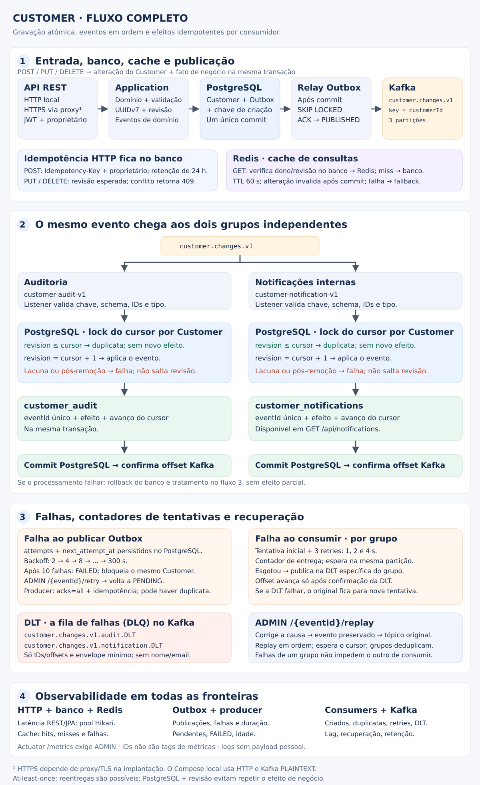

# Customer: execução e operação

Este exemplo segue a skill local e as referências de arquitetura. `customer` contém o domínio, os casos de uso, JPA,
Redis e Outbox; `audit` e `notification` recebem o contrato público de aplicação `CustomerChange`, sem acessar
repositórios internos de Customer. Spring MVC e JPA são bloqueantes; as transações ficam nos casos de uso, com OSIV
desabilitado.

## Executar

É necessário JDK 25, Docker, Docker Compose e acesso ao Maven Central. Use o Wrapper; se o terminal usa outra versão,
configure `JAVA_HOME` para JDK 25 antes de executar.

```sh
make env
make run
# Em outro terminal; exige curl, jq e OpenSSL:
make customer-demo
make test-customer
```

O Compose usa PostgreSQL 18, Redis 8 e Kafka 4.1.2; as portas são vinculadas a loopback. Não é necessário criar tópicos
manualmente: a aplicação cria `customer.changes.v1`, `customer.changes.v1.audit.DLT` e
`customer.changes.v1.notification.DLT`, com três partições. Não altere a quantidade de partições com eventos em
trânsito: o mapeamento da chave mudaria e poderia quebrar a ordem. Replicação 1 é específica do ambiente local; produção
exige configuração de replicação/ISR e TLS/ACLs adequada ao ambiente. As propriedades nativas Spring Kafka podem ser
configuradas externamente.

Cadastre um usuário em `POST /api/auth/signup`, obtenha o Bearer em `POST /api/auth/login` e use-o nas demais chamadas.
O script cria somente dados sintéticos e não imprime tokens. O usuário sintético de Identity permanece após a
demonstração.

## API

| Método | Caminho                                         | Contrato                                                                |
|--------|-------------------------------------------------|-------------------------------------------------------------------------|
| POST   | `/api/customers`                                | Header `Idempotency-Key: <UUID>`; JSON `name`, `email`; 201 + Location  |
| GET    | `/api/customers/{id}`                           | Detalhes autorizados; 200 ou 404                                        |
| GET    | `/api/customers?limit=20&after=<UUID>`          | Página por cursor de ID; limite 1–100; somente do proprietário          |
| PUT    | `/api/customers/{id}`                           | JSON `name`, `email`, `revision`; 200 com nova revisão                  |
| DELETE | `/api/customers/{id}?revision=2`                | Revisão esperada; 204, remoção física                                   |
| GET    | `/api/notifications`                            | Últimas 100 notificações internas do usuário, ordenadas da mais recente |
| POST   | `/api/admin/customer-delivery/{eventId}/retry`  | ADMIN; retoma Outbox FAILED; 202                                        |
| POST   | `/api/admin/customer-delivery/{eventId}/replay` | ADMIN; republica evento PUBLISHED preservado; 202                       |

A revisão começa em 1 e avança a cada alteração, inclusive remoção. Email é normalizado e único por proprietário.
Revisão desatualizada, email duplicado ou reutilização de chave com outros dados retornam 409; dados inválidos retornam
400. Recursos de outro proprietário retornam 404 sem revelar existência. Signup não permite autoatribuição de ADMIN. A
concessão dessa role exige o processo administrativo existente de Identity; não há backdoor de bootstrap.

A chave de criação é reservada no PostgreSQL na mesma transação. Repetir a chave com os mesmos dados retorna o Customer
atual sem criar outro evento, mesmo em concorrência; não representa um snapshot imutável da resposta original. Repetir
após remoção retorna 409 e não recria o perfil. A reserva dura 24 horas, com limpeza horária; depois da limpeza, uma
chave pode ser usada novamente. O cliente deve sempre gerar uma nova chave para uma nova intenção de criação. PUT/DELETE
usam revisão esperada para impedir efeitos repetidos e perda de atualização.

## Consistência e entrega



[Ver a imagem em tamanho completo](assets/customer-flow.svg).

```text
REST autenticado
  → Create / Find / Update / Delete Customer
  → PostgreSQL: Customer + evento Outbox + reserva de criação [commit atômico]
  → publicador Outbox [lock SKIP LOCKED, confirmação Kafka]
  → customer.changes.v1 [key = customerId]
       → customer-audit-v1 → PostgreSQL customer_audit
       → customer-notification-v1 → PostgreSQL customer_notifications → /api/notifications
```

A notificação é uma notificação interna efetivamente persistida e consultável. Não há envio de email/SMS ou gateway
externo simulado. Adicionar um fornecedor requer outra porta e idempotência própria.

O scheduler processa até 20 registros por ciclo (500 ms por padrão), com uma transação por registro e espera de
confirmação limitada a 10 s. O producer usa `acks=all`, idempotência e uma requisição em trânsito. Publicar e marcar
Outbox continuam sendo duas operações; uma queda entre ambas pode duplicar o evento. Não há garantia de exactly-once de
ponta a ponta.

A Outbox seleciona somente a menor revisão ainda não publicada de cada Customer. Locks de linha com `SKIP LOCKED`
permitem múltiplas instâncias sem concorrência no mesmo evento. Falhas persistem tentativas e próximo horário: 2, 4, 8,
16, 32, 64, 128, 256, 300… segundos, limitado a 300 s. Depois de 10 tentativas, o registro fica FAILED e bloqueia
somente eventos posteriores do mesmo Customer. A retomada exige correção da causa e retry administrativo. Não existe
abandono silencioso.

Os consumidores têm grupos, factories e DLTs independentes. Cada um confirma offsets por registro somente após o commit
PostgreSQL. Cursor bloqueado por Customer e constraints sobre event ID/revisão tornam a persistência idempotente. Um
replay de revisão já aplicada não produz novo efeito. Revisões com lacuna falham; não são aplicadas fora de ordem. O
handler repete três vezes com backoff de 1, 2 e 4 segundos e depois confirma o envio à DLT antes de avançar o offset
original. Uma falha ao enviar à DLT mantém o registro para nova tentativa. O retry bloqueia a partição durante o
backoff, preservando a ordem dos registros válidos; uma falha permanente de um Customer pode atrasar outros da mesma
partição até a recuperação/DLT.

Depois de uma DLT, revisões posteriores desse Customer também poderão ir à DLT por lacuna. Corrija a causa, localize o
evento original e faça replay em ordem de revisão, aguardando o cursor avançar a cada passo. O replay publica no tópico
original; o consumidor que já concluiu descarta a duplicata. O endpoint não espera a conclusão dos consumidores. Não
remova o cursor nem salte revisões para esconder uma falha.

A DLT contém envelope mínimo de falha, chave UUID e event ID quando válido e headers de tópico/partição/offset
originais; payloads rejeitados, mensagens de exceção e stack traces não são copiados. Use o offset original no tópico
(retido por 7 dias) ou procure `customer_outbox` pelo Customer e revisão (eventos publicados retidos por 30 dias).
Payload inválido não deve ser republicado sem correção do produtor/contrato.

Consultas úteis, sem nome/email:

```sql
SELECT event_id, customer_id, revision, status, attempts, next_attempt_at
FROM customer_outbox
WHERE status <> 'PUBLISHED'
ORDER BY occurred_at;
SELECT event_id, revision, event_type
FROM customer_outbox
WHERE customer_id = '<customer UUID>'
ORDER BY revision;
SELECT customer_id, revision
FROM customer_audit_cursor;
SELECT customer_id, revision
FROM customer_notifications_cursor;
```

## Cache e privacidade

GET individual usa cache de detalhes por ID + revisão. Uma consulta indexada PostgreSQL confirma proprietário/revisão
mesmo no hit. Um lock compartilhado mantém o preenchimento do cache antes de qualquer remoção/alteração concorrente;
escritores usam lock exclusivo. Alterações invalidam a revisão anterior somente após commit; rollback preserva a entrada
válida. Não há cache de listas nem de autorização. Redis indisponível ou conteúdo inválido produz fallback ao banco e
métrica de falha.

Nome identifica o Customer na interface; email fornece seu contato comercial. Não há CPF, telefone, endereço ou dados
sensíveis. Somente esses dois campos são persistidos no perfil/cache; eventos e notificações contêm IDs técnicos,
revisão, tipo, schema e horário. IDs associados a pessoas continuam exigindo proteção e não são anonimização. UUIDv7,
gerado pela biblioteca JUG, é usado para Customer e event IDs; chaves de requisição são fornecidas pelo cliente e
aceitam UUIDs comuns.

O TTL padrão é 60 s, limitado a 5 minutos. DELETE elimina o perfil PostgreSQL e invalida o cache. Se Redis estiver
indisponível no commit, cópias inacessíveis permanecem somente até o TTL; GET verifica a inexistência no banco e nunca
serve essa cópia. Transportes e armazenamento local são de demonstração; controles de acesso, criptografia em repouso,
TLS, backups e segredo do ambiente devem seguir os requisitos de implantação.

A política técnica demonstrativa elimina Customer sem alteração por 365 dias, pelo caso de uso normal, gerando evento de
remoção. Um job horário trata lotes de 100, preservando perfis atualizados em concorrência. Outbox publicada, auditoria
e notificações são removidas depois de 30 dias, por jobs próprios de cada contexto; cursors somente 31 dias após o evento de remoção. O cursor de um
Customer ativo permanece durante seu ciclo de vida, mesmo quando as evidências individuais expiram, para permitir
atualizações após longos períodos de inatividade. Contratos rejeitam eventos com mais de 30 dias, impedindo recriação de
efeitos depois da expiração da deduplicação. Chaves/fingerprints de criação expiram em 24 horas. Kafka e DLT têm
retenção de 7 dias ou 100 MiB por partição, o que ocorrer primeiro. O responsável pelo tratamento deve validar
finalidade, fundamento e prazos antes de produção; a feature não presume uma base legal.

Os jobs independentes preservam a propriedade `app.customer.jobs.enabled` e o intervalo
`app.customer.retention.poll-ms`, com uma hora de espera inicial por padrão. Não há
garantia de ordem ou transação conjunta entre retenção de customer, audit e notification.

Registros PENDING/FAILED são evidência operacional e não são apagados automaticamente antes da recuperação: precisam de
revisão diária, resolução ou descarte aprovado pelo responsável, incluindo a decisão sobre a cadeia posterior. Eventos
vencidos não são aceitos no replay. Backups e réplicas precisam de política própria de expiração; a remoção física da
tabela não elimina automaticamente essas cópias.

## Observabilidade e testes

Actuator expõe saúde, info e métricas; métricas exigem ADMIN. REST usa `http.server.requests`, operações de perfil usam
`customer.persistence.duration` e conexões usam métricas Hikari, Kafka usa as observações de producer/listener e
métricas de clientes. A feature registra hits/misses/falhas de cache, publicação/falhas/tempo da Outbox, quantidade
pendente/FAILED e idade do mais antigo, resultados/deduplicação/falhas/DLT por consumidor, recuperação e execução de
retenção. IDs e mensagens não são tags de métricas. Logs de publicação usam somente event ID, classe do erro e
esgotamento, sem payload ou mensagem de exceção; erros dos listeners são sanitizados antes de chegar ao logger do
handler. O PostgreSQL local usa logs de erros sem DETAIL, parâmetros ou statements rejeitados. A categoria
`org.hibernate.orm.jdbc.error` fica desabilitada, pois mensagens de constraints PostgreSQL podem incluir email; falhas
de persistência aparecem em `customer.persistence.failures`, sem valores pessoais. Indisponibilidade transacional é
traduzida para 503 com mensagem genérica.

Investigue aumento de `customer.outbox.oldest.seconds`, qualquer `customer.outbox.failed`, `customer.consumer.dlt` e
falhas contínuas de cache. Verifique também lag dos grupos Kafka, saúde PostgreSQL/Redis e métricas do pool. Os nomes
HTTP do endpoint Actuator de counters seguem os nomes fornecidos ao Micrometer.

Os testes usam fixtures sintéticas, JDK 25 e PostgreSQL/Redis/Kafka independentes via Testcontainers. Incluem domínio
sem Spring, casos de uso com portas substituídas, HTTP com JWT real, rollback de JPA + SQL Outbox,
duplicidade/concorrência, cache hit/TTL/corrupção/invalidação, pause/unpause reais de Redis/Kafka, retry/DLT de um
consumidor sem interromper o outro, replay ordenado e retenção de perfis.

Referências técnicas usadas para as APIs: [gerador UUIDv7 JUG](https://github.com/cowtowncoder/java-uuid-generator)
e [tratamento de falhas Spring Kafka](https://docs.spring.io/spring-kafka/reference/kafka/annotation-error-handling.html).
